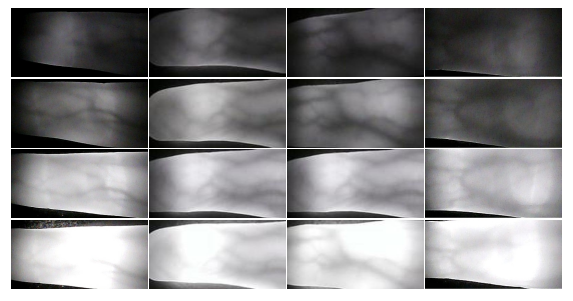

# MIFVD
A dataset used to verify the performance of finger vein recognition in outdoor dynamic multi-illumination scenarios. 

Samples from the MIFVD, Each row represents data collected under different lighting sessions. From top to bottom, they correspond to WL, WSL, SSL, and SL, respectively.

## Dataset acquisition method
